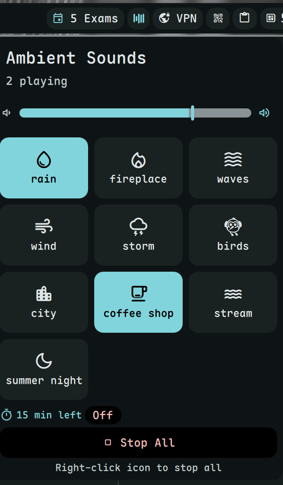

# Ambient Sound

Play ambient sounds for focus and relaxation.



## Install


**Required:** This plugin requires [dms-common](https://github.com/hthienloc/dms-common) to be installed.

```bash
# 1. Install shared components
git clone https://github.com/hthienloc/dms-common ~/.config/DankMaterialShell/plugins/dms-common

# 2. Install this plugin
dms plugins install ambientSound
```

Or manually:
```bash
git clone https://github.com/hthienloc/dms-ambient-sound ~/.config/DankMaterialShell/plugins/ambientSound
```

## Features

- **14 built-in sounds** - Rain, storm, wind, waves, fireplace, city, etc.
- **Mix & match** - Play multiple sounds simultaneously
- **Presets** - Save and load your favorite sound combinations
- **Sleep timer** - Auto-stop with configurable actions (mute, lock, suspend)

## Usage

| Action | Result |
|--------|--------|
| Left click | Open sound mixer |
| Right click | Mute/unmute |

## Requirements

- `mpv` - Audio player for sound playback
- `socat` - IPC communication with mpv

## License

GPL-3.0

## Roadmap / TODO

- [ ] **MPRIS Integration**: Control playback and volume from system media controllers.
- [ ] **Cross-fade Transitions**: Smoothly fade sounds in and out when switching presets or stopping.
- [ ] **Custom Sound Support**: Ability to add personal `.ogg` or `.mp3` files to a user-defined folder.
- [ ] **Environmental Effects**: Basic filters (e.g., "Muffled/Behind Wall" effect) using mpv's audio filters.
- [ ] **Advanced Scheduling**: Set timers or calendar-based triggers to auto-start specific soundscapes.
- [ ] **Dynamic Soundscapes**: Sounds that vary slightly over time to prevent "loop fatigue."
